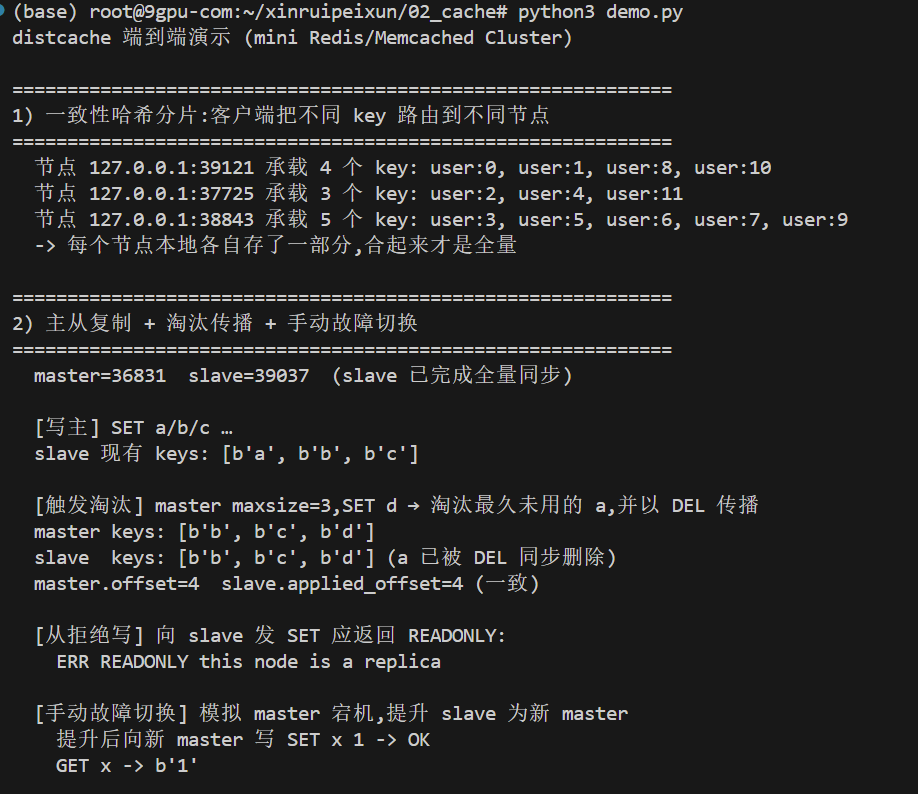
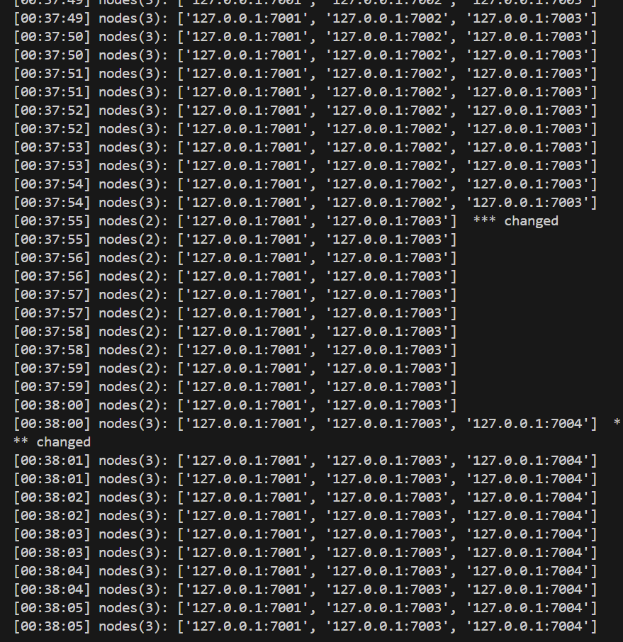
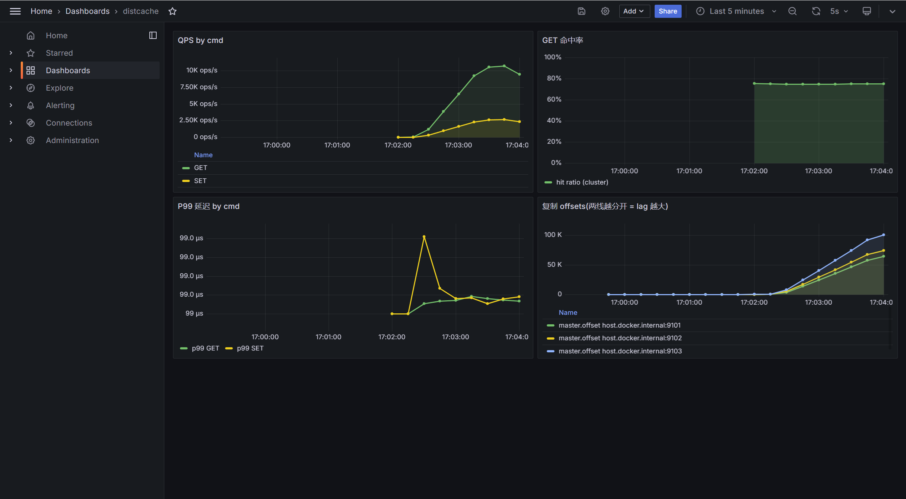

# SD-03 分布式缓存系统(mini Redis / mini Memcached Cluster)

使用 **Python + asyncio**。每个核心概念都"真实现"而非玩具版:手写 O(1) LRU、RESP 风格协议与分帧、带虚拟节点的一致性哈希、master→slave 异步复制(effect batch)。

**v2 在 v1 的内核之上,新增 Prometheus 指标、etcd 服务发现、Grafana 仪表盘** —— 把"能跑"的原型变成"能运营"的小型分布式缓存。

> 本项目遵循 SDD(规范驱动开发)流程,完整的 proposal / specs / design / tasks 见 [`openspec/`](openspec/) —— v1 内核见 [`changes/archive/2026-06-22-add-distributed-cache/`](openspec/changes/archive/2026-06-22-add-distributed-cache/),v2 可观测性 + 服务发现见 [`changes/add-etcd-prom-grafana/`](openspec/changes/add-etcd-prom-grafana/)。完整演示手册见 [`docs/doc/demo-playbook.md`](docs/doc/demo-playbook.md)。

---

## v1 → v2:从"能跑"到"能运营"

| 维度 | v1 | v2 (本版) |
|------|----|----|
| **核心能力** | LRU / TTL / 协议 / 分片 / 主从 / 故障切换 | **完全保留**,行为不变,测试不破坏 |
| **运行时依赖** | 仅标准库 | 仍仅需标准库;`prometheus_client` / `etcd3` 为**可选** |
| **客户端配置** | 手动写死节点 `[(host, port), ...]` | 只给 etcd 地址,节点列表自动维护 |
| **节点上下线** | 客户端需要重启或人工通知 | etcd lease 自动注册 / 失活,客户端环 ≤ TTL 自动收敛 |
| **可观测性** | 看 print / 日志 | `/metrics` 暴露 8 个指标家族,Grafana 实时仪表盘 |
| **排障** | 翻 stdout | QPS / 命中率 / P99 / 复制 lag 在图上一眼可见 |
| **依赖隔离** | — | 未装可选依赖时全部 metric 埋点降级为 no-op,etcd 不会被 import |

---

## 核心能力

### v1 内核(无第三方依赖)

| 功能 | 实现要点 |
|------|---------|
| LRU 淘汰 | 哈希表 + 双向链表,`get/set/delete` 均摊 O(1)(不使用 `OrderedDict`) |
| TTL 过期 | 绝对 deadline;authoritative 模式惰性删除 + 采样清理,logical 模式只读不删 |
| TCP 服务器 | `asyncio`,每连接一协程,支持并发 |
| 自定义协议 | RESP 风格;请求双模式(inline 便于 `nc` 调试 + RESP array 承载二进制);正确分帧解决粘包 |
| 一致性哈希分片 | 哈希环 + 虚拟节点,客户端侧路由,增删节点只影响 ~1/N 的 key |
| 主从复制(简化版) | 异步复制、effect batch、重连全量同步、手动故障切换 |

### v2 新增(可选依赖,未装自动降级)

| 功能 | 实现要点 |
|------|---------|
| Prometheus 指标 | 8 个指标家族(`distcache_*`),每节点独立 `/metrics` 端口 |
| etcd 服务发现 | 节点 lease 自动注册;客户端 watch 前缀回调 `add/remove_node`,环线程安全 |
| Grafana 仪表盘 | docker-compose 一键起,预配 4 面板:QPS / 命中率 / P99 / 复制 offsets |
| 监控栈 | docker compose 三件套:etcd + Prometheus + Grafana(datasource UID 固定为 `prometheus`,删卷重建后无须改 dashboard) |
| 演示脚本 | `scripts/{load,watch_ring,demo_replication}.py` 用于可视化演示,均做了优雅退出处理(零异常噪音) |

---

## 架构

```
                   客户端
              (一致性哈希客户端侧路由)
                       │
   ┌─────────── etcd ──┤   v2 新增:节点 lease 注册 + 客户端 watch
   │                   │
   ▼                   ▼ RESP / TCP
  watch              ┌─────┬─────┬─────┐
  事件                ▼     ▼     ▼     ▼
                  Node A  Node B  Node C        ← 分片层(横向扩容量)
                 (master)(master)(master)
                    │
                    │ effect batch 异步复制
                    ▼
                  Node A' (slave)               ← 副本层(纵向扩可用性)
                    │
                    │  /metrics 9101 / 9102 / ...
                    ▼
                Prometheus ──→ Grafana          ← v2 新增:可观测性
```

模块(`distcache/`):

- `lru.py` — O(1) LRU + TTL 存储
- `protocol.py` — RESP 双模式编解码 + 增量分帧解析器
- `server.py` — asyncio 缓存节点(master/slave、写路径临界区、手动切换)
- `hashring.py` — 一致性哈希环 + 虚拟节点(线程安全,适配 watcher 后台回调)
- `client.py` — 客户端侧一致性哈希路由(阻塞 socket),支持 etcd 自动发现
- `replication.py` — effect batch 复制流、master 推送、slave 全量同步与回放
- `metrics.py` — Prometheus 指标定义,未装依赖时降级 no-op *(v2 新增)*
- `discovery.py` — etcd 注册 / watch 封装,把 `etcd3` 依赖圈在本文件 *(v2 新增)*

---

## 运行方式

环境:Python 3.9+。v1 路径**完全不需要第三方依赖**;v2 可观测性功能依赖 `prometheus_client` + `etcd3 + protobuf<4`(已在 `requirements.txt` 中标明)。

### 1. v1 最小路径:nc 调试单节点

```bash
python3 serve.py --port 7001 --metrics-port 0   # --metrics-port 0 显式禁用 metrics
# 另开终端:
printf 'SET foo bar\r\nGET foo\r\n' | nc -q1 127.0.0.1 7001
# +OK
# $3
# bar
```

### 2. v1 端到端演示(分片 + 主从 + 故障切换)

```bash
python3 demo.py
```

一键展示:三节点一致性哈希分片、master 写从 slave 同步、淘汰合成 `DEL` 传播、手动提升 slave 为新 master。

### 3. 运行测试

```bash
pip install -r requirements.txt
python3 -m pytest -q
# 期望: 58 passed (2 个 etcd e2e 用例,有 etcd 服务时自动加入)
```

### 4. v2 完整路径:可观测性 + 服务发现

```bash
# (1) 起监控栈三件套(etcd + Prometheus + Grafana)
cd deploy && docker compose up -d && cd ..

# (2) 起三个节点:注册到 etcd + 暴露 /metrics
#     用 nohup + disown 防止节点跟随 shell 退出
for i in 1 2 3; do
  nohup python3 serve.py --port 700$i --metrics-port 910$i \
                          --etcd 127.0.0.1:2379 \
                          --shard $(echo ABC | cut -c$i) \
                          > /tmp/n700$i.log 2>&1 &
  disown
done
sleep 10   # 等 Prometheus 完成首次抓取(scrape_interval=5s)

# (3) 验证三节点全 up
curl -sG http://127.0.0.1:9090/api/v1/targets | python3 -c "
import json, sys
for t in json.load(sys.stdin)['data']['activeTargets']:
    if '910' in t['labels'].get('instance', ''):
        print(t['labels']['instance'], t['health'])"
# 期望: 9101/9102/9103 全部 up

# (4) 客户端完全不知道节点地址,只靠 etcd 发现
python3 -c "from distcache.client import DistributedCacheClient as C; \
            c = C(etcd_endpoints=['127.0.0.1:2379']); \
            [c.set('user:%d' % i, 'v%d' % i) for i in range(100)]; \
            print('routed nodes:', {c.route('user:%d' % i) for i in range(100)})"

# (5) 给 Grafana 制造活跃曲线:预热 30s + 满载 90s
python3 scripts/load.py --duration 30 --qps 200 \
                         --hit 0.6 --miss 0.2 --set 0.2 --keyspace 1000
python3 scripts/load.py --duration 90 \
                         --hit 0.6 --miss 0.2 --set 0.2 --keyspace 1000

# (6) 浏览器打开 http://localhost:3000  (admin / admin)
#     Dashboards → distcache → 4 面板:QPS / 命中率 / P99 / 复制 offsets
```

**配套演示脚本**(`scripts/`,均已做优雅退出处理):

| 脚本 | 用途 |
|---|---|
| `scripts/load.py` | 可调命中率 / QPS 的负载生成器,给 Grafana 制造活跃曲线 |
| `scripts/watch_ring.py` | 实时观察客户端哈希环成员变化,演示 etcd 服务发现 |
| `scripts/demo_replication.py` | 一键起 master+slave 子进程,展示复制 offset 分叉与追平 |

**完整截图剧本** 详见 [`docs/doc/demo-playbook.md`](docs/doc/demo-playbook.md)。

---

## 功能展示

### v1:端到端核心能力(分片 + 主从 + 淘汰传播 + 故障切换)

`python3 demo.py` 一脚本跑通 v1 的全部核心能力 —— 在 v2 中**行为完全不变**,作为"没破坏 v1"的最强证明。



可读出的事实:

- 12 个 key 被一致性哈希分到 3 个节点 (4/3/5 分布)
- master 写后 slave 立刻能 `GET` 到
- master `maxsize=3` 触发淘汰,合成的 `DEL` 同步到 slave,两边 keys 一致
- slave 拒绝写命令返回 `-ERR READONLY`
- master 宕机后,`slave.promote()` 让原 slave 接受 `SET`,故障切换完成

### v2 新增能力 ① — etcd 服务发现:客户端环自动收敛

`scripts/watch_ring.py` 实时打印客户端环的成员快照。下图记录了 16 秒内的两次自动事件:



- **第一次 `*** changed`**(00:37:54):节点 7002 被 `kill -9` 后,etcd lease 在 ≤10s 内过期,etcd 删除其注册;客户端 watcher 触发 `remove_node`,环从 `nodes(3)` 缩到 `nodes(2)`。
- **第二次 `*** changed`**(00:38:00):一个新节点 7004 启动并注册到 etcd,客户端 watcher 触发 `add_node`,环从 `nodes(2)` 扩到 `nodes(3)`,**全程 ≤2s**(PUT 即时通知,而 DELETE 受 lease TTL 限制)。

整套过程**客户端没收到任何人工通知**,完全靠 etcd 的 watch 机制自驱。

### v2 新增能力 ② — Grafana 可观测性仪表盘

按上面 §4 步骤跑一次预热 30s + 主负载 90s,Grafana 仪表盘四面板实时反映系统状态:



时间窗 *Last 5 minutes*、刷新 *5s*。各面板:

- **左上 QPS by cmd**:GET / SET 各自的速率。可见单段斜坡上升,GET 约 10K ops/s、SET 约 2.5K ops/s,符合 load.py 的 6:2 命中比例。
- **右上 GET 命中率**(集群整体):稳定在 **~0.75**(理论值 `0.6 / (0.6 + 0.2) = 75%`)。图例 `hit ratio (cluster)` 表示这是用 `sum()` 聚合掉 `result` 标签后的全集群命中率。
- **左下 P99 延迟 by cmd**:histogram quantile 派生的 GET / SET P99;本机部署延迟落入最小 bucket (~99µs),曲线接近平直,跨网络部署会拉开差距。
- **右下 复制 offsets**:每个节点的 `distcache_replication_offset{role}`,三条 master.offset 曲线 (9101 / 9102 / 9103) **从 0 同步起涨**;若挂上 slave,master / slave 两条线分开的距离即复制 lag。

---

## 协议示例

请求(双模式,服务器按首字节区分):

```
# inline(人工调试)
SET foo bar\r\n
GET foo\r\n

# RESP array(客户端库,可承载二进制 / 含空格值)
*3\r\n$3\r\nSET\r\n$3\r\nfoo\r\n$3\r\nbar\r\n
```

响应(统一 RESP):

```
+OK\r\n            # 简单状态
-ERR <msg>\r\n     # 错误
$3\r\nbar\r\n      # bulk 值
$-1\r\n            # 空值(miss)
```

支持命令:`SET key value [EX secs]`、`SETEX key secs value`、`GET key`、`DEL key`、`EXPIRE key secs`、`PING`、`ROLE`。slave 上的写命令返回 `-ERR READONLY`。

---

## 复制语义(要点)

- 复制流流动的是 master **应用后的效果**(effect),以 **batch** 为单位,一个单调递增 `offset` 对应一组原子效果。
- 淘汰 / 过期删除会合成 `DEL` 进入复制流;`EXPIRE` 改写为绝对时间的 `PEXPIREAT`。
- slave 是被动状态机:走非淘汰的回放路径,**不自主淘汰 / 过期删除**,以 batch 为单位原子回放。
- 异步复制:master 完成"本地应用 + effect 入队"即返回客户端,不等 slave ACK。
- 重连一律全量同步(快照 + `snapshot_offset` + 期间写缓冲),本版不做 partial sync。

---

## 可观测性指标家族

每个节点的 `/metrics` 端口暴露以下 Prometheus 指标:

| 指标 | 类型 | 含义 |
|---|---|---|
| `distcache_ops_total{cmd,result}` | Counter | 命令计数,result ∈ {hit, miss, ok, readonly, error, ...} |
| `distcache_op_latency_seconds{cmd}` | Histogram | 命令处理延迟(bucket: 100µs ~ 1s) |
| `distcache_cache_size` | Gauge | 当前 key 数(后台采样,默认 1s 周期) |
| `distcache_cache_maxsize` | Gauge | 容量上限(启动配置) |
| `distcache_evictions_total` | Counter | 累计 LRU 淘汰次数 |
| `distcache_replication_offset{role}` | Gauge | master.offset(role=master) 或 applied_offset(role=slave) |
| `distcache_replication_lag` | Gauge | 复制 lag(slave 侧:seen_offset - applied_offset) |
| `distcache_role` | Gauge | 1=master, 0=slave;`promote()` 时翻转 |

未安装 `prometheus_client` 时,以上指标对象全部退化为 no-op(`metrics.py` 同时定义了真实现与 no-op 两条路径),业务代码不需要任何 `if metrics_enabled:` 分支。

**dashboard 查询要点**(供自行扩展参考):

```promql
# QPS by cmd(按命令拆分)
sum by (cmd) (rate(distcache_ops_total[1m]))

# 集群整体 GET 命中率(必须 sum 掉 result 标签,否则 hit/hit=1 永远是 100%)
sum(rate(distcache_ops_total{cmd="GET",result="hit"}[1m]))
  / clamp_min(sum(rate(distcache_ops_total{cmd="GET"}[1m])), 1e-9)

# 按命令的 P99 延迟
histogram_quantile(0.99,
  sum by (le, cmd) (rate(distcache_op_latency_seconds_bucket[1m])))
```

---

## 测试

```bash
python3 -m pytest -q     # 期望: 58 passed
python3 -m pytest -v     # 按用例名打印
```

**58 个用例**覆盖 8 个模块:`lru / protocol / hashring / server / replication / sharding / metrics / discovery`。

其中 `tests/test_discovery.py` 的 2 个 e2e 用例需要本机有 etcd 服务才会启用:

```bash
# 起监控栈后,e2e 用例自动启用
cd deploy && docker compose up -d && cd ..
python3 -m pytest -q tests/test_discovery.py    # 9 passed (无 etcd 时 7 passed, 2 skipped)
```

`test_metrics.py` 同时验证两条路径:**no-op 兼容性**(无 `prometheus_client` 时埋点不抛异常)和 **真启用路径**(在 `REGISTRY` 里能读到正确的 Counter / Gauge 值)。

---

## 实操经验(踩过的坑 → 配套防御)

| 现象 | 原因 | 已做的防御 |
|---|---|---|
| 节点用 `&` 启动,关闭终端就消失 | `&` 后台进程跟随 shell 收到 SIGHUP | README 示例统一用 `nohup ... & disown`(见 §4 第 2 步) |
| 删卷重建后 Grafana 面板全 No data | 自动生成的 datasource UID 与 dashboard 写死的 UID 不匹配 | `deploy/grafana/provisioning/datasources/ds.yml` 固定 `uid: prometheus` |
| GET 命中率永远 100% | 查询表达式分子 / 分母 `result` 标签没聚合掉,变成 `hit/hit` | `dashboard.json` 改为 `sum(...)` 包裹分子分母 |
| `load.py` 退出末尾 `Aborted (core dumped)` | etcd3 v0.12 守护线程与 Python 3.11 finalize 阶段竞态 | `scripts/load.py` 装 `threading.excepthook` 过滤 etcd3 噪音 + `os._exit(0)` 跳过 finalize |
| Prometheus target 显示 down,但节点其实 OK | 节点启动后立即查,scrape 还没发生 | 查询前 `sleep 10`(scrape_interval 5s) |

---